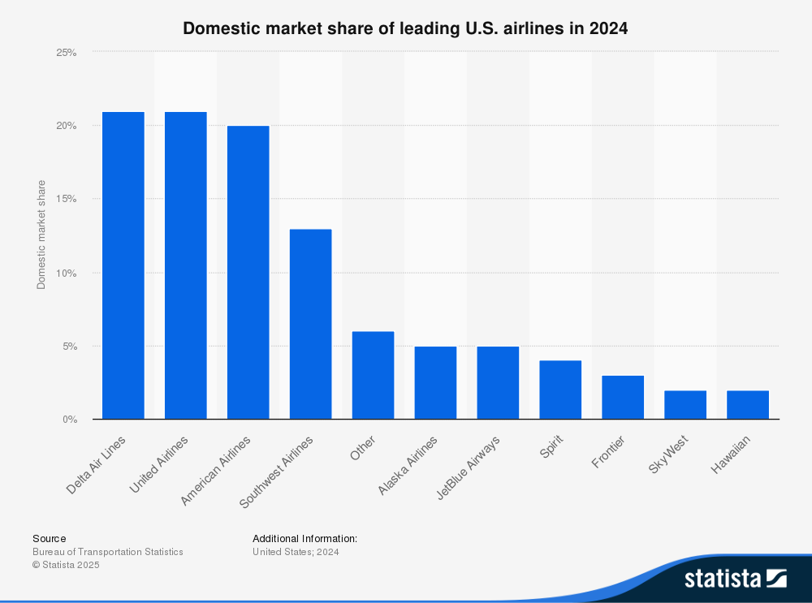
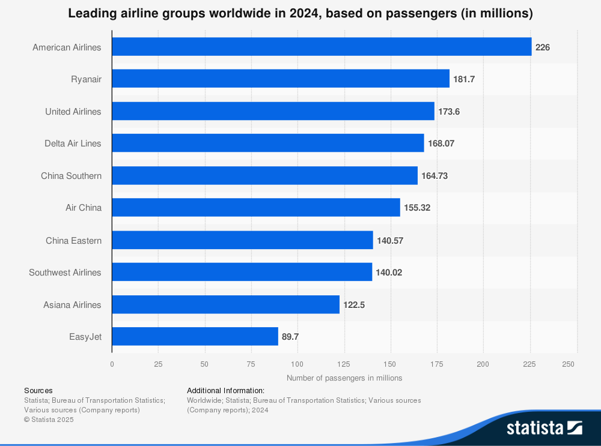

## Introduction

The airline sector is a dynamic and highly competitive industry, exemplified by the diverse operational scales and market reach of its leading carriers. In global terms, United Airlines (UAL) stands among the top contenders, carrying nearly 174 million passengers in 2024, positioning it just behind American Airlines and Ryanair and ahead of Delta Air Lines and major Asian carriers. Domestically, UAL holds one of the largest shares of the U.S. market, closely competing with Delta and American Airlines, each capturing just over 20% of the market. JetBlue Airways (JBLU) and SkyWest (SKYW), while significantly smaller than UAL, demonstrate the sector’s diversity: JetBlue carves out a notable niche with roughly 5% market share focused on hybrid low-cost service, whereas SkyWest operates with a regional business model and holds about a 2% share, supporting major airlines through contract flying and serving less densely populated routes.

{fig-align="center"}

These contrasts highlight the broad spectrum of business strategies—from global giants like UAL with extensive international and domestic networks, to regionally specialized carriers like SKYW, and innovative low-cost competitors such as JBLU. Together, they illustrate how scale, operational focus, and market segmentation define competition and opportunity within the airline industry.

{fig-align="center"} 

## Key Findings

The industry-wide data illustrates a definitive trajectory from the severe operational and financial downturn of 2020 towards a sustained, albeit uneven, recovery. Revenue across all three carriers declined significantly during the pandemic’s initial phase, resulting in substantial net losses. Nevertheless, the subsequent years demonstrate a robust rebound in top-line growth, with United Airlines standing out for scale. Profitability has shown a more gradual recovery, hampered by fluctuating fuel and labor costs. The analysis underscores that, although revenue has largely normalized, the quality of earnings and the resilience of balance sheets remain critical differentiators among competitors.

The primary insight from this comparative analysis is that SkyWest (SKYW) has a resilient, strategically advantageous financial profile relative to its peers. While United Airlines’ recovery in operational scale is impressive, SkyWest’s strength is evident in its stable financial structure. This is supported by a Net Debt-to-Equity ratio of approximately 102% in 2024, substantially lower than United Airlines’ ratio, which ranged from about 85% to 177% during the same period, depending on the report and period considered. These ratios confirm that SkyWest’s balance sheet remains healthier and less leveraged than its larger competitor, providing a solid basis for its long-term financial sustainability. Additionally, SkyWest has consistently generated positive free cash flow annually since 2022, a milestone that JetBlue has not achieved. This combination of low leverage and dependable internal cash generation positions SkyWest exceptionally well to navigate forthcoming market uncertainties and to capitalize on emerging opportunities, without being hindered by financial distress.

The following table offers a high-level summary of each airline's performance profile based on the detailed analysis within this report.

| Performance Category | United Airline (UAL) | Jet Blue (JBLU) | SkyWest (SKYW) |
|:----------------:|------------------|------------------|------------------|
| **Financial Health** | Exhibited significant deleveraging since 2021, though the balance sheet remains highly leveraged. Liquidity is strong. | Leverage has increased steadily, reflecting persistent net losses and strategic investments, posing a risk to financial stability. | Maintained a consistently conservative and strong balance sheet with the lowest leverage, providing significant financial flexibility. |
| **Profitability** | Achieved a robust revenue recovery and returned to strong profitability by 2023, with solid operating and net margins in 2024. | Struggled to achieve consistent profitability, posting net losses in four of the last five years and demonstrating weak margin performance. | Demonstrated stable, positive operating margins throughout the period, with consistent net profitability since 2023. |
| **Operational Efficiency** | Generated powerful operating cash flows post-2021, though free cash flow has been volatile due to high capital expenditures. | Cash flow from operations has been inconsistent and often failed to cover net losses, resulting in consistently negative free cash flow. | Produced remarkably stable and positive operating and free cash flows, showcasing a highly efficient and resilient business model. |
| **Stock Recommendation** | Hold | Sell | Buy & Hold |

: High-level summary of each airline's performance

## Video Summary

The video below provides a concise summary of the key insights from this analysis.

We made this using NotebookLM by Google and thought it would be interesting to share.

There are two flavors of it one with only our report as the source and one with report and additional graphs and data.

### Video summary (report as the only source)

::: {=html}
<iframe width="560" height="315"
    src="https://drive.google.com/file/d/1x9hVKlXo93zLBRdp3u8pHbQLVHazETmc/preview"
    allow="autoplay; encrypted-media" allowfullscreen>
</iframe>
:::

### Video summary (report + additional data and graphs)

::: {=html}
<iframe width="560" height="315"
    src="https://drive.google.com/file/d/1oCLcfIKFVxkXtqjhYAl7M0fbs16Y3IWd/preview"
    allow="autoplay; encrypted-media" allowfullscreen>
</iframe>
:::

## Conclusion

In conclusion, the U.S. airline sector presents a landscape of varied financial fortitude. United Airlines has successfully leveraged its scale to drive a powerful earnings recovery. JetBlue faces significant headwinds in its pursuit of sustainable profitability and balance sheet repair. SkyWest, with its distinct regional operating model, has emerged from the turbulent five-year period with the most durable and well-positioned financial structure, setting the stage for a stable long-term outlook.

